# Vibeboard - Developer Guide

## Overview

Vibeboard is an AI-powered visual canvas platform for creating interactive component-based interfaces. It combines AI generation (Cerebras), visual canvas manipulation (React Flow), and native ES module execution in an ESM-first architecture with import maps for React singleton management.

## Project Structure

```
vibeboard/                         # Monorepo root
├── apps/
│   ├── frontend/                 # React frontend application
│   │   ├── public/
│   │   │   ├── shims/           # React singleton shims
│   │   │   ├── components/      # Pre-built library components
│   │   │   └── test-components/ # ESM test components
│   │   ├── src/
│   │   │   ├── components/      # React components
│   │   │   ├── services/        # Business logic services
│   │   │   ├── utils/           # Utility functions
│   │   │   ├── types/           # TypeScript types
│   │   │   └── data/            # Static data and generated files
│   │   └── bit-components/      # Bit.dev managed components
│   └── backend/                 # (Future) Backend services
├── packages/                    # Shared packages
├── pnpm-workspace.yaml         # PNPM workspace configuration
└── .envrc                      # direnv configuration
```

## Current Architecture

### Core Stack
- **React 19** with TypeScript
- **React Flow** (@xyflow/react) - Visual canvas for component arrangement
- **Cerebras AI** - Fast component generation using Llama models
- **Babel Standalone** - Runtime JSX transpilation
- **Native Import Maps** - Browser-native module resolution
- **Vite** - Development and build tooling
- **PNPM** - Package manager with workspace support
- **Bit.dev** - Component management platform (configured)

### Key Design Decisions

#### 1. Monorepo Architecture
- PNPM workspaces for managing multiple apps/packages
- Centralized environment configuration
- Prepared for future backend services
- Shared dependencies and tooling

#### 2. ESM-First Architecture
The entire system is built around ES modules:
- All components are ES modules with standard `import`/`export` syntax
- Direct CDN imports work without bundling (esm.sh, unpkg, skypack)
- Native browser import maps handle module resolution
- No UMD or CommonJS support needed

#### 3. React Singleton Pattern
Solved the "Invalid Hook Call" error permanently:
```javascript
// Import map in index.html redirects all React imports
"imports": {
  "react": "/shims/react.js",
  "react-dom": "/shims/react-dom.js",
  "react/jsx-runtime": "/shims/react-jsx-runtime.js"
}

// Shims return window.React (the app's instance)
export default window.React;
```

#### 4. Component Pipeline
Unified processing system for all component sources:
- **AI-generated**: Cerebras API → Import fixing → JSX transpilation → Execution
- **Library**: Pre-built code → Compilation cache → Direct execution
- **URL import**: Fetch → Format detection → Processing → Caching
- **Pre-compiled**: Skip transpilation for performance

## Development Setup

### Prerequisites
- Node.js 16+ (recommended: 20+)
- PNPM 8+ (`npm install -g pnpm`)
- direnv (optional but recommended)

### Quick Start
```bash
# Clone repository
git clone git@github.com:Zabaca/vibeboard.git
cd vibeboard

# Copy environment configuration
cp .env.example .env
# Edit .env and add your Cerebras API key

# Install dependencies
pnpm install

# Start development server
pnpm dev

# The frontend will be available at http://localhost:5173
```

### Environment Variables
All environment variables are centralized in the root `.env` file:
- `VITE_CEREBRAS_API_KEY` - Your Cerebras API key
- `NODE_ENV` - Development/production mode
- Future backend variables are documented in `.env.example`

## Component Flow

### 1. AI Generation Flow
```
User Prompt → Cerebras API → Raw JSX Code
    ↓
Import Fixer (adds missing React imports)
    ↓
ESM Wrapper (converts to ES module if needed)
    ↓
JSX Transpiler (Babel: JSX → JS)
    ↓
Blob URL Creation
    ↓
Dynamic Import → React Component
```

### 2. URL Import Flow
```
URL Input → Fetch Module
    ↓
Format Detection (ESM/JSX/Compiled)
    ↓
[If JSX] → Transpilation
[If ESM] → Direct Use
    ↓
Module Execution → Component
```

### 3. Library Component Flow
```
Pre-built Component → Check Compiled Cache
    ↓
[If Cached] → Use Compiled Version
[If Not] → Runtime Compilation
    ↓
Add to Canvas
```




```mermaid
graph TB
    %% Entry Points
    GenBtn["🎨 Generate Component Button<br/>(User clicks)"] --> AI["AI Code<br/>import { motion } from 'framer-motion'"]
    LibBtn["📚 Component Library Button<br/>(User clicks)"] --> LibComp["Pre-built Component<br/>with CDN URL"]
    URLBtn["🔗 Import from URL Button<br/>(User enters CDN URL)"] --> URLComp["CDN URL Import<br/>e.g. https://esm.sh/my-component"]
    TestBtn["🧪 ESM Test Component<br/>(Development testing)"] --> TestComp["Test imports<br/>from CDN directly"]
    
    %% AI Flow
    AI --> Pipeline["ComponentPipeline<br/>Processes JSX to JS"]
    Pipeline --> ESM["esmExecutor.resolveImports()<br/>Rewrites bare imports to URLs"]
    ESM --> Rewritten["Code with full URLs<br/>'https://esm.sh/framer-motion?external=react,react-dom'"]
    Rewritten --> Blob["Creates Blob URL<br/>with rewritten code"]
    Blob --> Import["import(blobURL)<br/>Executes the module"]
    Import --> Success["Component Renders<br/>Single React instance"]
    
    %% CDN Direct Import Flow (Simplified)
    LibComp --> Direct["Direct Import<br/>No processing needed"]
    URLComp --> Direct
    TestComp --> Direct
    Direct --> Success
    
    classDef entry fill:#fab005,stroke:#f08c00,stroke-width:3px
    classDef success fill:#51cf66,stroke:#2f9e44,stroke-width:2px
    classDef normal fill:#4c6ef5,stroke:#364fc7,stroke-width:2px,color:#fff
    
    class GenBtn,LibBtn,URLBtn,TestBtn entry
    class Success,Direct success
    class Pipeline,ESM,Rewritten,Blob,Import normal
```

## Key Components

### Frontend Components (`apps/frontend/src/components/`)

#### ReactFlowCanvas.tsx
The main orchestrator that:
- Manages all nodes and their positions
- Handles component generation workflow
- Implements presentation mode
- Manages persistence and export/import
- Provides UI controls and keyboard shortcuts

#### ComponentNode.tsx
Custom React Flow node that:
- Renders generated components
- Handles resize and positioning
- Shows component metadata
- Provides action buttons

#### GeneratedApp.tsx
The component executor that:
- Creates safe execution context
- Handles runtime errors gracefully
- Manages component lifecycle
- Provides loading states
- Shows detailed error messages

### Services (`apps/frontend/src/services/`)

#### ComponentPipeline.ts
Unified processing service that:
- Detects component format (JSX/ESM/TSX)
- Manages compilation cache
- Handles all transpilation
- Fixes missing imports automatically
- Provides performance metrics

#### cerebras.ts
AI service that:
- Interfaces with Cerebras API
- Manages API keys and endpoints
- Handles prompt engineering
- Provides error handling

### Utilities (`apps/frontend/src/utils/`)

#### esmExecutor.ts
Module execution engine that:
- Creates blob URLs for modules
- Manages dynamic imports
- Handles module cleanup
- Provides execution context

## Component Data Structure

```typescript
interface UnifiedComponentNode {
  // Identity
  id: string;
  name?: string;
  description?: string;
  
  // Code
  originalCode: string;      // Source JSX/TSX
  compiledCode?: string;     // Transpiled JS
  
  // Hashing
  originalHash?: string;     // For change detection
  compiledHash?: string;     // For cache validation
  
  // Source info
  source: 'ai-generated' | 'library' | 'url-import';
  sourceUrl?: string;
  moduleUrl?: string;        // Blob URL for execution
  
  // Metadata
  compiledAt?: number;
  compilerVersion?: string;
  metrics?: {
    compilationTime?: number;
    dependencies?: string[];
  };
}
```

## Monorepo Commands

### Development
```bash
# Start frontend dev server
pnpm dev

# Start specific app
pnpm --filter frontend dev

# Run command in all apps
pnpm -r <command>
```

### Building
```bash
# Build frontend
pnpm build

# Build all apps
pnpm build:all

# Type checking
pnpm typecheck
```

### Testing
```bash
# Run tests (when implemented)
pnpm test

# Lint code
pnpm lint
```

## Common Issues & Solutions

### 1. Multiple React Instances
**Symptom**: "Invalid Hook Call" error
**Solution**: Import maps automatically handle this

### 2. Import Statement Errors
**Symptom**: "Cannot use import statement outside a module"
**Solution**: Component Pipeline converts to proper ESM

### 3. Missing Hook Imports
**Symptom**: "useState is not defined"
**Solution**: ImportFixer automatically adds missing imports

### 4. CDN CORS Issues
**Symptom**: Network errors on import
**Solution**: Use proxy endpoints or `?external=react` parameter

### 5. Storage Full
**Symptom**: Components not saving
**Solution**: Use cleanup button or export/clear/import

## Bit.dev Integration

### Current Status
- Bit workspace initialized with scope `zabaca.zabaca`
- React environment configured
- Component structure prepared in `bit-components/`

### Next Steps (Parent Goal 2)
1. Audit existing components
2. Create component metadata
3. Standardize component structure
4. Migrate components to Bit format

## Future Enhancements

### Planned
- Backend API service
- WebContainer API for full dev environment
- Collaborative editing with WebRTC
- Git integration for version control
- TypeScript support in editor
- Component marketplace via Bit.dev

### Experimental
- Web Workers for transpilation
- WASM-based Babel for speed
- Service Worker caching
- Offline mode support

## Security Considerations

- Components run in same context (no sandboxing)
- AI-generated code is not validated
- URL imports could be malicious
- Use trusted CDNs only
- Implement CSP headers in production

## Deployment

### Netlify Configuration
- Base directory: `apps/frontend`
- Build command: `pnpm build`
- Publish directory: `apps/frontend/dist`
- Functions directory: `apps/frontend/netlify/functions`
- Environment variables set in Netlify dashboard

### Production Optimizations
- Disable debug logging
- Enable minification (currently disabled for debugging)
- Use CDN for static assets
- Enable gzip compression

## Contributing

When contributing to Vibeboard:
1. Follow the monorepo structure
2. Keep components in appropriate directories
3. Update types when adding features
4. Test with ESMTestComponent first
5. Ensure pnpm build passes
6. Follow ESM-first principles
7. Follow the coding standards below

## Coding Standards

### 🚫 ANTI-`any` RULE 🚫
**NEVER use `any` type. Always use explicit types.**

Quick substitutions:
- `any` → specific interface/type
- `any[]` → `T[]` or `unknown[]` 
- `any` for JSON → `unknown` + type guards
- `any` for external APIs → define response schema
- `any` for temporary typing → `TODO:` comment with proper type

### 🚫 ANTI-`as` CASTING RULE 🚫
**AVOID using `as` type assertions. Use proper typing instead.**

Better alternatives:
- Type guards or type predicates
- Proper generic types
- Validate and narrow types
- Redesign the code structure

```typescript
// ❌ BAD: Using as casting
const data = response as UserData;

// ✅ GOOD: Type guards
if (isUserData(response)) {
  const data = response; // properly typed
}

// ✅ GOOD: Proper validation
const userSchema = z.object({
  id: z.string(),
  name: z.string()
});
const data = userSchema.parse(response);
```

### TypeScript Rules for AI-Generated Components

#### Rule 1: No Complex Control Flow
**Use early returns and guard clauses. Avoid nested ternaries.**

```typescript
// ❌ Bad
const Component = () => {
  return user ? (user.active ? (user.permissions.length > 0 ? <Dashboard /> : <NoAccess />) : <Inactive />) : <Login />;
};

// ✅ Good
const Component = () => {
  if (!user) return <Login />;
  if (!user.active) return <Inactive />;
  if (user.permissions.length === 0) return <NoAccess />;
  return <Dashboard />;
};
```

#### Rule 2: Explicit Component Props
**Always define explicit prop interfaces. Never use `any` for props.**

```typescript
// ❌ Bad
function Button(props: any) {
  return <button>{props.label}</button>;
}

// ✅ Good
interface ButtonProps {
  label: string;
  onClick?: () => void;
  variant?: 'primary' | 'secondary';
  disabled?: boolean;
}

function Button({ label, onClick, variant = 'primary', disabled = false }: ButtonProps) {
  return (
    <button 
      onClick={onClick} 
      disabled={disabled}
      className={`btn-${variant}`}
    >
      {label}
    </button>
  );
}
```

#### Rule 3: Use Functional Components with Hooks
**Prefer functional components. Class components only when absolutely necessary.**

```typescript
// ✅ Good - Functional component with hooks
const Timer: React.FC = () => {
  const [seconds, setSeconds] = useState(0);
  
  useEffect(() => {
    const interval = setInterval(() => {
      setSeconds(s => s + 1);
    }, 1000);
    
    return () => clearInterval(interval);
  }, []);
  
  return <div>Seconds: {seconds}</div>;
};
```

#### Rule 4: Validate All External Data
**Use Zod schemas for API responses, form data, and URL imports.**

```typescript
// Component data validation
const componentSchema = z.object({
  id: z.string(),
  name: z.string(),
  code: z.string(),
  source: z.enum(['ai-generated', 'library', 'url-import'])
});

// API response validation
const cerebrasResponseSchema = z.object({
  choices: z.array(z.object({
    message: z.object({
      content: z.string()
    })
  }))
});

// Always validate before use
const validateComponent = (data: unknown) => {
  return componentSchema.parse(data);
};
```

#### Rule 5: Small, Focused Components
**Components should do one thing well and fit in ~50 lines.**

```typescript
// ✅ Good - Single responsibility
const ComponentCard: React.FC<ComponentCardProps> = ({ component, onEdit, onDelete }) => {
  return (
    <div className="component-card">
      <h3>{component.name}</h3>
      <p>{component.description}</p>
      <div className="actions">
        <button onClick={() => onEdit(component.id)}>Edit</button>
        <button onClick={() => onDelete(component.id)}>Delete</button>
      </div>
    </div>
  );
};

// Separate concerns into different components
const ComponentList: React.FC<ComponentListProps> = ({ components }) => {
  return (
    <div className="component-list">
      {components.map(component => (
        <ComponentCard key={component.id} component={component} />
      ))}
    </div>
  );
};
```

#### Rule 6: Explicit Error Handling
**Handle errors gracefully with proper types.**

```typescript
// Define error types
interface ComponentError {
  code: 'PARSE_ERROR' | 'COMPILE_ERROR' | 'RUNTIME_ERROR';
  message: string;
  details?: unknown;
}

// Error boundary for components
const ComponentErrorBoundary: React.FC<{ children: React.ReactNode }> = ({ children }) => {
  const [error, setError] = useState<ComponentError | null>(null);
  
  if (error) {
    return (
      <div className="error-display">
        <h3>Component Error: {error.code}</h3>
        <p>{error.message}</p>
        <button onClick={() => setError(null)}>Retry</button>
      </div>
    );
  }
  
  return <ErrorBoundary onError={setError}>{children}</ErrorBoundary>;
};
```

#### Rule 7: Type-Safe Event Handlers
**Use proper typing for all event handlers.**

```typescript
// ❌ Bad
const handleClick = (e: any) => {
  console.log(e.target.value);
};

// ✅ Good
const handleClick = (e: React.MouseEvent<HTMLButtonElement>) => {
  e.preventDefault();
  // Handle click
};

const handleChange = (e: React.ChangeEvent<HTMLInputElement>) => {
  const value = e.target.value;
  // Handle change
};

const handleSubmit = (e: React.FormEvent<HTMLFormElement>) => {
  e.preventDefault();
  // Handle form submission
};
```

#### Rule 8: Avoid Deep Prop Drilling
**Use composition and context wisely.**

```typescript
// ❌ Bad - Deep prop drilling
<App user={user} theme={theme}>
  <Layout user={user} theme={theme}>
    <Header user={user} theme={theme}>
      <UserMenu user={user} theme={theme} />
    </Header>
  </Layout>
</App>

// ✅ Good - Use context for cross-cutting concerns
const UserContext = createContext<User | null>(null);
const ThemeContext = createContext<Theme>('light');

// Compose with providers
<UserContext.Provider value={user}>
  <ThemeContext.Provider value={theme}>
    <App />
  </ThemeContext.Provider>
</UserContext.Provider>
```

#### Rule 9: ESM-First Component Structure
**All components must be proper ES modules.**

```typescript
// ✅ Good - ESM component structure
import React, { useState, useEffect } from 'react';

interface MyComponentProps {
  title: string;
  onUpdate?: (value: string) => void;
}

export const MyComponent: React.FC<MyComponentProps> = ({ title, onUpdate }) => {
  const [value, setValue] = useState('');
  
  useEffect(() => {
    onUpdate?.(value);
  }, [value, onUpdate]);
  
  return (
    <div>
      <h2>{title}</h2>
      <input value={value} onChange={(e) => setValue(e.target.value)} />
    </div>
  );
};

export default MyComponent;
```

#### Rule 10: Consistent State Management
**Use appropriate state management for component complexity.**

```typescript
// Local state for simple components
const SimpleCounter: React.FC = () => {
  const [count, setCount] = useState(0);
  return <button onClick={() => setCount(c => c + 1)}>{count}</button>;
};

// useReducer for complex state logic
interface State {
  components: ComponentNode[];
  selectedId: string | null;
  isLoading: boolean;
}

type Action = 
  | { type: 'ADD_COMPONENT'; payload: ComponentNode }
  | { type: 'SELECT_COMPONENT'; payload: string }
  | { type: 'SET_LOADING'; payload: boolean };

const reducer = (state: State, action: Action): State => {
  switch (action.type) {
    case 'ADD_COMPONENT':
      return { ...state, components: [...state.components, action.payload] };
    case 'SELECT_COMPONENT':
      return { ...state, selectedId: action.payload };
    case 'SET_LOADING':
      return { ...state, isLoading: action.payload };
    default:
      return state;
  }
};
```

### Frontend-Specific Guidelines

#### CSS and Styling
- Use CSS modules or inline styles for component-specific styling
- Keep global styles minimal
- Use CSS variables for theming

```typescript
// CSS modules approach
import styles from './Component.module.css';

const Component: React.FC = () => {
  return <div className={styles.container}>Content</div>;
};

// Inline styles with proper typing
const buttonStyle: React.CSSProperties = {
  padding: '8px 16px',
  backgroundColor: '#007bff',
  color: 'white',
  border: 'none',
  borderRadius: '4px'
};
```

#### Performance Considerations
- Use React.memo for expensive components
- Implement proper key props for lists
- Lazy load heavy components

```typescript
// Memoize expensive components
const ExpensiveComponent = React.memo(({ data }: Props) => {
  // Complex rendering logic
  return <div>{/* ... */}</div>;
});

// Lazy loading
const HeavyComponent = React.lazy(() => import('./HeavyComponent'));

// Use with Suspense
<Suspense fallback={<Loading />}>
  <HeavyComponent />
</Suspense>
```

### Code Quality Tools

#### ESLint Configuration
The project uses ESLint with React-specific rules:
- `eslint-plugin-react-hooks` for hooks rules
- `eslint-plugin-react-refresh` for HMR compatibility

#### Type Checking
- Run `pnpm typecheck` before committing
- Fix all TypeScript errors
- No `@ts-ignore` without justification

#### Build Validation
- Ensure `pnpm build` passes
- Check bundle size impacts
- Verify no console errors in production build

### Testing Guidelines

When tests are implemented:
1. Test component behavior, not implementation
2. Use React Testing Library
3. Focus on user interactions
4. Mock external dependencies properly
5. Test error states and edge cases

```typescript
// Example test structure (future)
import { render, screen, fireEvent } from '@testing-library/react';
import { Button } from './Button';

describe('Button', () => {
  it('should call onClick when clicked', () => {
    const handleClick = vi.fn();
    render(<Button label="Click me" onClick={handleClick} />);
    
    fireEvent.click(screen.getByText('Click me'));
    expect(handleClick).toHaveBeenCalledTimes(1);
  });
});
```