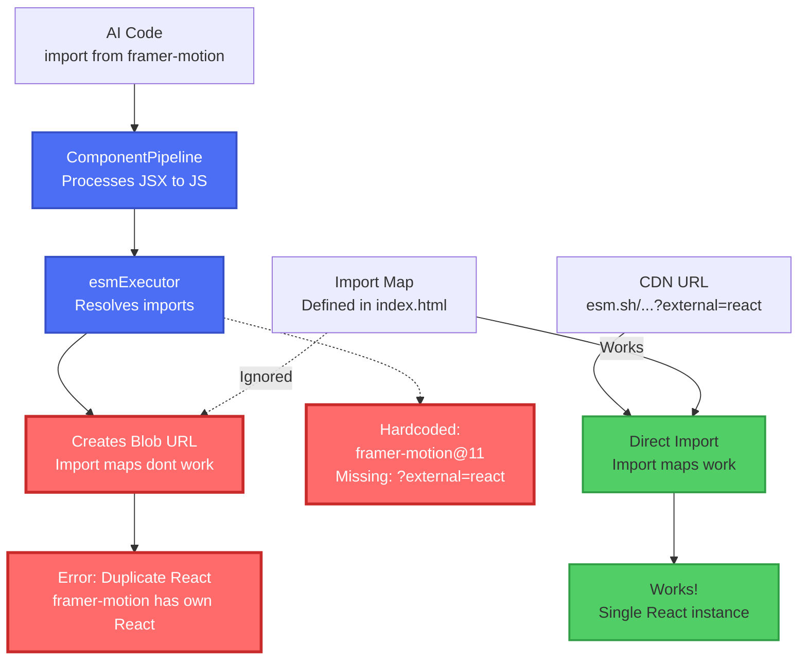

# AI Component Processing Flow

## Overview
This diagram shows how AI-generated components are processed and where the import resolution issue occurs.

## Simplified Flow Diagram



## Detailed Flow Diagram

```mermaid
graph TB
    AI[AI Generates Code<br/>with bare imports<br/>'import { motion } from framer-motion'] --> RFC[ReactFlowCanvas<br/>handleGenerateComponent]
    
    RFC --> CP[ComponentPipeline<br/>processAIComponent]
    
    CP --> PC[processComponent<br/>- Validates code exists<br/>- Detects format JSX/ESM]
    
    PC --> PESM[processESMComponent]
    
    PESM --> IF[ImportFixer<br/>- Adds missing React imports<br/>- Fixes useState, useEffect, etc.]
    
    IF --> JSX{Has JSX?}
    
    JSX -->|Yes| TRANS[ESMJsxTranspiler<br/>- Babel transpilation<br/>- JSX → JavaScript]
    JSX -->|No| VALID
    
    TRANS --> VALID[Validation Step<br/>esmExecutor.executeModule]
    
    VALID --> RESOLVE[resolveImports<br/>- Resolves bare imports<br/>- Hardcoded CDN mappings]
    
    RESOLVE --> BLOB[createModuleUrl<br/>Creates blob URL]
    
    BLOB --> IMPORT[import blob URL]
    
    RESOLVE -.->|PROBLEM HERE| HARD[Hardcoded Mappings<br/>framer-motion: esm.sh/framer-motion@11<br/>❌ Missing ?external=react,react-dom]
    
    IMPORT --> ACL[AsyncComponentLoader<br/>Receives compiled component]
    
    ACL --> RENDER[Render Component]
    
    URL[Direct CDN URL<br/>with ?external=react] --> ACL2[AsyncComponentLoader<br/>moduleUrl path]
    
    ACL2 --> DIRECT[Direct import<br/>✅ Import maps work!]
    
    DIRECT --> RENDER
    
    MAP[Import Map in index.html<br/>framer-motion: esm.sh/...?external=react,react-dom] -.->|❌ Ignored in blob context| BLOB
    MAP -->|✅ Works for direct imports| DIRECT
    
    classDef problem fill:#ff6b6b,stroke:#c92a2a,stroke-width:3px,color:#fff
    classDef success fill:#51cf66,stroke:#2f9e44,stroke-width:2px
    classDef process fill:#4c6ef5,stroke:#364fc7,stroke-width:2px,color:#fff
    classDef data fill:#fab005,stroke:#f08c00,stroke-width:2px
    
    class HARD,BLOB problem
    class DIRECT,MAP success
    class CP,PESM,VALID,RESOLVE process
    class AI,RFC data
```

## Key Points

### The Problem
1. AI generates code with standard imports: `import { motion } from 'framer-motion'`
2. Code is processed through ComponentPipeline (JSX → JS transpilation)
3. esmExecutor resolves imports using hardcoded mappings
4. Hardcoded mapping for framer-motion is missing `?external=react,react-dom`
5. Creates blob URL where import maps don't work
6. Result: Duplicate React instance error

### Why Import Maps Fail
- Blob URLs create an isolated module context
- Browser doesn't apply import maps to `blob:` URLs
- All imports must be resolved before creating the blob

### The Solution
Update the hardcoded mapping in `esmExecutor.ts` line 222:
```javascript
// From:
'framer-motion': 'https://esm.sh/framer-motion@11',

// To:
'framer-motion': 'https://esm.sh/framer-motion@11.0.0?external=react,react-dom',
```

### Alternative Approaches
1. **Direct CDN imports**: Skip blob URLs entirely
2. **Script injection**: Use script tags instead of blob URLs
3. **Dynamic import map reading**: Read from actual import map instead of hardcoding