# AI Component Processing Flow

## Overview
This diagram shows how AI-generated components are processed through the pipeline and how import resolution works.

## Simplified Flow Diagram

```mermaid
graph TB
    %% Entry Points
    GenBtn["🎨 Generate Component Button<br/>(User clicks)"] --> AI["AI Code<br/>import { motion } from 'framer-motion'"]
    LibBtn["📚 Component Library Button<br/>(User clicks)"] --> LibComp["Pre-built Component<br/>with CDN URL"]
    URLBtn["🔗 Import from URL Button<br/>(User enters CDN URL)"] --> URLComp["CDN URL Import<br/>e.g. https://esm.sh/my-component"]
    TestBtn["🧪 ESM Test Component<br/>(Development testing)"] --> TestComp["Test imports<br/>from CDN directly"]
    
    %% AI Flow
    AI --> Pipeline["ComponentPipeline<br/>Processes JSX to JS"]
    Pipeline --> ESM["esmExecutor.resolveImports()<br/>Rewrites bare imports to URLs"]
    ESM --> Rewritten["Code with full URLs<br/>'https://esm.sh/framer-motion?external=react,react-dom'"]
    Rewritten --> Blob["Creates Blob URL<br/>with rewritten code"]
    Blob --> Import["import(blobURL)<br/>Executes the module"]
    Import --> Success["Component Renders<br/>Single React instance"]
    
    %% CDN Direct Import Flow (Simplified)
    LibComp --> Direct["Direct Import<br/>No processing needed"]
    URLComp --> Direct
    TestComp --> Direct
    Direct --> Success
    
    classDef entry fill:#fab005,stroke:#f08c00,stroke-width:3px
    classDef success fill:#51cf66,stroke:#2f9e44,stroke-width:2px
    classDef normal fill:#4c6ef5,stroke:#364fc7,stroke-width:2px,color:#fff
    
    class GenBtn,LibBtn,URLBtn,TestBtn entry
    class Success,Direct success
    class Pipeline,ESM,Rewritten,Blob,Import normal
```

## Key Points

### How It Works
1. **AI generates code** with bare module imports: `import { motion } from 'framer-motion'`
2. **ComponentPipeline** processes the code:
   - ImportFixer adds missing React imports
   - ESMJsxTranspiler converts JSX to JavaScript
   - Passes to esmExecutor for validation
3. **esmExecutor.resolveImports()** rewrites ALL bare imports to full URLs:
   - `'framer-motion'` → `'https://esm.sh/framer-motion?external=react,react-dom'`
   - `'react'` → `'http://localhost:5173/shims/react.js'` (special shim)
   - `'lodash'` → `'https://esm.sh/lodash?external=react,react-dom'`
4. **Blob URL** is created with the rewritten code (all imports are now full URLs)
5. **import(blobURL)** executes the module
6. **Component renders** successfully

### Import Resolution Strategy
- esmExecutor rewrites ALL bare imports to full CDN URLs
- All non-React packages get `?external=react,react-dom` parameter (ESM.sh ignores it)
- React/React-DOM imports are rewritten to local shims that export window.React
- Import maps are NOT used in blob URL context (browser doesn't apply them)
- The rewriting happens BEFORE the blob URL is created

### Entry Points in the App

#### 1. Generate Component Button (AI Flow)
- **Location**: Main toolbar in ReactFlowCanvas
- **Flow**: User enters prompt → Cerebras AI generates code → Full pipeline processing → Blob URL
- **Example**: "Create a login form with animations"

#### 2. Component Library Button (Direct CDN)
- **Location**: Library icon in toolbar
- **Flow**: Select pre-built component → Direct import from CDN → No processing needed
- **Components**: Animated Button, Profile Card, Counter, etc.

#### 3. Import from URL (CDN Only)
- **Location**: URL icon in toolbar
- **Flow**: Direct import from CDN - no processing needed
- **Supported CDNs**: esm.sh, unpkg.com, jsdelivr.net, skypack.dev
- **Example**: `https://esm.sh/@vibeboard/button?external=react,react-dom`
- **Note**: URL must include `?external=react,react-dom` to prevent React conflicts

#### 4. ESM Test Component (Direct CDN)
- **Location**: Test view in the app
- **Flow**: Direct imports from CDN using import maps
- **Purpose**: Testing CDN imports without blob URLs

### Two Loading Paths

#### Path 1: Blob URL (AI-Generated Code)
- Used for: AI-generated code only
- Process: Full pipeline → Import rewriting → Blob URL
- Import maps: NOT used (imports already rewritten)

#### Path 2: Direct Import (CDN URLs)
- Used for: Pre-built components, all URL imports
- Process: Direct `import(url)` - no processing
- Import maps: Work normally for app code
- Requirement: URL must be from approved CDN (esm.sh, unpkg, jsdelivr, skypack)

### Recent Improvements
1. **Simplified import resolution**: All packages use `?external=react,react-dom` by default
2. **Better edit experience**: Split Save Code and Regenerate actions
3. **Live syntax highlighting**: Using react-simple-code-editor with Prism.js
4. **Fixed regeneration flow**: Properly handles prompt-based AI generation
5. **Simplified URL imports**: Only CDN URLs supported - no complex fallback logic