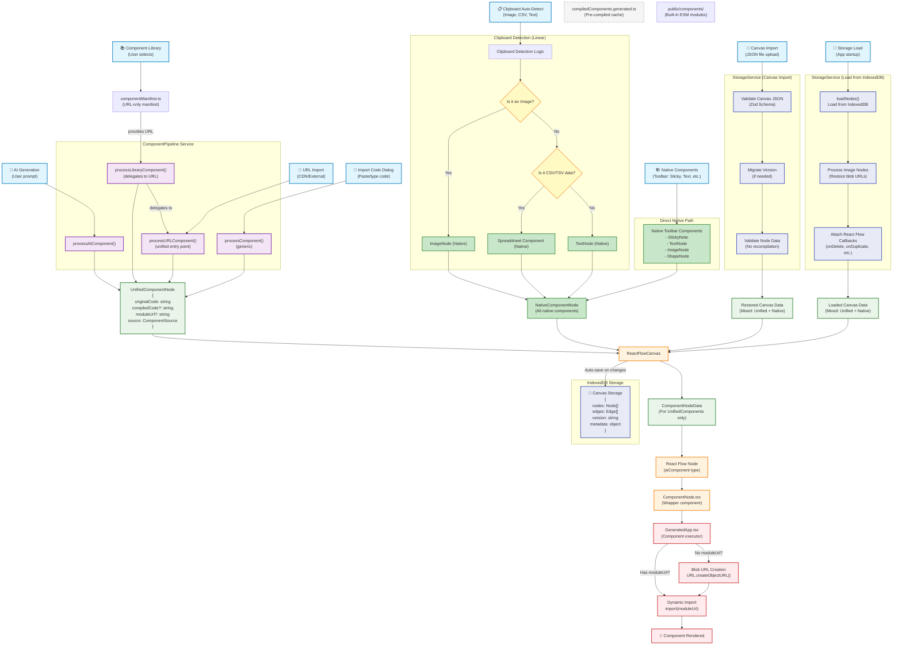

# Component Flow Architecture

This document describes the complete data flow for how components enter, get processed, and are rendered in the ReactFlowCanvas system.

## Overview

The system supports multiple entry points for components, all of which eventually flow through the ReactFlowCanvas for rendering. Components can be:
- AI-generated from user prompts
- Selected from a component library
- Imported from external URLs
- Pasted from clipboard (with auto-detection)
- Added as native components (sticky notes, text, etc.)
- Loaded from storage on app startup
- Imported from saved canvas files

## Architecture Diagram



## Entry Points

### 1. **AI Generation** 🤖
- **Input**: User prompt text
- **Processing**: `ComponentPipeline.processAIComponent()`
- **Output**: `UnifiedComponentNode` with AI-generated JSX code
- **Notes**: Goes through full transpilation pipeline

### 2. **Component Library** 📚
- **Input**: User selects from component library
- **Processing**: URL-only architecture:
  - **Manifest**: `componentManifest.ts` provides component URL
  - **Pipeline**: `ComponentPipeline.processLibraryComponent()` → `processURLComponent()`
  - **Loading**: Fetch component from URL (local `/components/` or CDN)
- **Output**: `UnifiedComponentNode` with URL-loaded component
- **Notes**: Unified architecture - all components load via URLs

### 3. **URL Import** 🔗
- **Input**: CDN URL (esm.sh, unpkg, etc.)
- **Processing**: `ComponentPipeline.processURLComponent()`
- **Output**: `UnifiedComponentNode` with external component reference
- **Notes**: Validates CDN URLs and handles React externalization

### 4. **Import Code Dialog** 📝
- **Input**: User pastes/types component code
- **Processing**: `ComponentPipeline.processComponent()` (generic)
- **Output**: `UnifiedComponentNode` with user-provided code
- **Notes**: Manual code input with full validation

### 5. **Clipboard Auto-Detect** 📋
- **Input**: Clipboard content (images, CSV, text)
- **Processing**: Linear detection logic → Native components only
- **Output**: `NativeComponentNode` objects
- **Notes**: Bypasses ComponentPipeline entirely

### 6. **Canvas Import** 📁
- **Input**: JSON file with saved canvas data
- **Processing**: `StorageService` validation and migration (NO ComponentPipeline)
- **Output**: Mixed `UnifiedComponentNode` and `NativeComponentNode` objects
- **Notes**: Restores previously saved components as-is

### 7. **Native Components** 🏗️
- **Input**: Toolbar actions (Sticky Note, Text, Shape, etc.)
- **Processing**: Direct native component creation
- **Output**: `NativeComponentNode` objects
- **Notes**: Bypasses ComponentPipeline entirely

### 8. **Storage Load** 💾
- **Input**: App startup triggers storage load
- **Processing**: `StorageService.loadNodes()` with image processing and callback attachment
- **Output**: Mixed `UnifiedComponentNode` and `NativeComponentNode` objects
- **Notes**: Restores complete canvas state from IndexedDB

## Data Types

### UnifiedComponentNode
Used for code-based components that go through the ComponentPipeline:
```typescript
interface UnifiedComponentNode {
  id: string;
  originalCode: string;      // Source JSX/TSX
  compiledCode?: string;     // Transpiled JS
  moduleUrl?: string;        // Blob URL or import path
  source: 'ai-generated' | 'library' | 'url-import';
  format: 'jsx' | 'tsx' | 'esm';
  // ... metadata
}
```

### NativeComponentNode
Used for native components that bypass the ComponentPipeline:
```typescript
interface NativeComponentNode {
  id: string;
  componentType: 'native';
  nativeType: 'sticky' | 'text' | 'image' | 'shape';
  state: ComponentState;
  // ... native-specific fields
}
```

## Processing Services

### ComponentPipeline
Handles code-based components with these methods:
- `processAIComponent()` - AI-generated components
- `processLibraryComponent()` - Legacy library components (OLD path)
- `processManifestComponent()` - Async library components (NEW path)
- `processURLComponent()` - External CDN components
- `processComponent()` - Generic component processing

### StorageService
Handles persistence with these key methods:
- `saveNodes()` / `loadNodes()` - Auto-save on canvas changes
- `importCanvas()` - Import from JSON file
- `validateAndEnhanceNodeData()` - Validation without recompilation

## Rendering Pipeline

### For UnifiedComponentNode objects:
1. **ReactFlowCanvas** receives the node
2. **ComponentNodeData** wraps it for React Flow
3. **React Flow Node** (type: 'aiComponent') renders it
4. **ComponentNode.tsx** wrapper component
5. **GeneratedApp.tsx** executes the component
6. **Blob URL creation** or **Dynamic import** for execution
7. **Component rendered** in the canvas

### For NativeComponentNode objects:
1. **ReactFlowCanvas** receives the node
2. **Direct native rendering** (bypasses ComponentPipeline entirely)

## Storage System

All components eventually flow through the centralized storage system:

- **Auto-save**: Canvas changes are automatically saved to IndexedDB
- **Complete state**: Stores nodes, edges, version info, and metadata
- **Image handling**: Special processing for blob URLs in image components
- **Version migration**: Handles schema changes between app versions

## Current Architectural Challenges

### Async Component Loading Problem
The NEW component library path (`componentManifest.ts` → `processManifestComponent()`) creates `UnifiedComponentNode` objects with:
- Empty `originalCode` (no source available)
- Empty `compiledCode` (already compiled)
- Fake `moduleUrl` (e.g., `'builtin:simple-counter'`)

This causes issues in `GeneratedApp.tsx` which expects either:
- Real importable URLs
- Source code to convert to blob URLs

### Storage Round-Trip Issues
Since all components are saved/loaded from storage, async-loaded components with incomplete data will:
1. Be saved with empty code fields
2. Fail to render after app restart
3. Cannot be properly restored from storage

## Potential Solutions

1. **Extend GeneratedApp** to handle direct component instances
2. **Create parallel rendering path** for async components
3. **Make async components behave like native components**
4. **Extend UnifiedComponentNode** to support component instances
5. **Create hybrid data structure** for different component types

---

*Last updated: 2025-08-18*
*Diagram reflects current implementation with both OLD and NEW library paths*