# Component Flow Architecture

This document describes the complete data flow for how components enter, get processed, and are rendered in the ReactFlowCanvas system.

## Overview

The system supports multiple entry points for components, all of which eventually flow through the ReactFlowCanvas for rendering. Components can be:
- AI-generated from user prompts
- Selected from a component library
- Imported from external URLs
- Pasted from clipboard (with auto-detection)
- Added as native components (sticky notes, text, etc.)
- Loaded from storage on app startup
- Imported from saved canvas files

## Architecture Diagram

```mermaid
graph TB
    %% Entry Points
    AI["🤖 AI Generation<br/>(User prompt)"] 
    LIB["📚 Component Library<br/>(User selects)"]
    URL["🔗 URL Import<br/>(CDN/External)"]
    IMPORT_CODE["📝 Import Code Dialog<br/>(Paste/type code)"]
    PASTE["📋 Clipboard Auto-Detect<br/>(Image, CSV, Text)"]
    CANVAS_UPLOAD["📁 Canvas Import<br/>(JSON file upload)"]
    NATIVE["🏗️ Native Components<br/>(Toolbar: Sticky, Text, etc.)"]
    STORAGE_LOAD["💾 Storage Load<br/>(App startup)"]

    %% Clipboard Detection Logic
    subgraph "Clipboard Detection (Linear)"
        DETECT["Clipboard Detection Logic"]
        IMG_CHECK{"Is it an Image?"}
        CSV_CHECK{"Is it CSV/TSV data?"}
        IMG_NODE["ImageNode (Native)"]
        SPREAD_NODE["Spreadsheet Component (Native)"]
        TEXT_NODE["TextNode (Native)"]
    end

    %% Canvas Import Processing  
    subgraph "StorageService (Canvas Import)"
        VALIDATE["Validate Canvas JSON<br/>(Zod Schema)"]
        MIGRATE["Migrate Version<br/>(if needed)"]
        VALIDATE_NODES["Validate Node Data<br/>(No recompilation)"]
    end

    %% Storage Load Processing
    subgraph "StorageService (Load from IndexedDB)"
        LOAD_NODES["loadNodes()<br/>Load from IndexedDB"]
        PROCESS_IMAGES["Process Image Nodes<br/>(Restore blob URLs)"]
        ATTACH_CALLBACKS["Attach React Flow Callbacks<br/>(onDelete, onDuplicate, etc.)"]
    end

    %% Processing Paths (URL-Only Architecture)
    subgraph "ComponentPipeline Service"
        PIPELINE_AI["processAIComponent()"]
        %% Removed PIPELINE_LIB - now unified under PIPELINE_URL
        PIPELINE_URL["processURLComponent()<br/>(unified entry point)"]
        PIPELINE_GENERIC["processComponent()<br/>(generic)"]
    end

    %% Native Path (bypasses pipeline)
    subgraph "Direct Native Path"
        NATIVE_TOOLBAR["Native Toolbar Components<br/>- StickyNote<br/>- TextNode<br/>- ImageNode<br/>- ShapeNode"]
    end

    %% Component Sources
    MANIFEST["componentManifest.ts<br/>(URL-only manifest)"]
    PUBLIC_COMPONENTS["public/components/<br/>(Built-in ESM modules)"]

    %% Data Outputs
    UNIFIED["UnifiedComponentNode<br/>{<br/>  originalCode: string<br/>  compiledCode?: string<br/>  moduleUrl?: string<br/>  source: ComponentSource<br/>}"]
    NATIVE_DATA["NativeComponentNode<br/>(All native components)"]
    RESTORED_DATA["Restored Canvas Data<br/>(Mixed: Unified + Native)"]
    LOADED_DATA["Loaded Canvas Data<br/>(Mixed: Unified + Native)"]

    %% Central Storage System
    subgraph "IndexedDB Storage"
        STORAGE["💾 Canvas Storage<br/>{<br/>  nodes: Node[]<br/>  edges: Edge[]<br/>  version: string<br/>  metadata: object<br/>}"]
    end

    %% Canvas Integration
    CANVAS["ReactFlowCanvas"]
    NODE_DATA["ComponentNodeData<br/>(For UnifiedComponents only)"]
    
    %% Rendering Chain (for UnifiedComponents)
    FLOW_NODE["React Flow Node<br/>(aiComponent type)"]
    COMPONENT_NODE["ComponentNode.tsx<br/>(Wrapper component)"]
    GENERATED_APP["GeneratedApp.tsx<br/>(Component executor)"]

    %% Final Execution (for UnifiedComponents)
    BLOB["Blob URL Creation<br/>URL.createObjectURL()"]
    IMPORT["Dynamic Import<br/>import(moduleUrl)"]
    RENDER["🎨 Component Rendered"]

    %% Flow connections
    
    %% AI Generation path
    AI --> PIPELINE_AI
    
    %% Library path (URL-Only with JSX transpilation)
    LIB --> MANIFEST
    MANIFEST --> |"provides URL"| PIPELINE_URL
    
    %% Import code path
    IMPORT_CODE --> PIPELINE_GENERIC
    
    %% URL import path
    URL --> PIPELINE_URL
    
    %% Clipboard detection (linear flow)
    PASTE --> DETECT
    DETECT --> IMG_CHECK
    IMG_CHECK -->|"Yes"| IMG_NODE
    IMG_CHECK -->|"No"| CSV_CHECK
    CSV_CHECK -->|"Yes"| SPREAD_NODE
    CSV_CHECK -->|"No"| TEXT_NODE
    
    %% Native components from toolbar
    NATIVE --> NATIVE_TOOLBAR
    
    %% Canvas import processing (NO ComponentPipeline)
    CANVAS_UPLOAD --> VALIDATE
    VALIDATE --> MIGRATE
    MIGRATE --> VALIDATE_NODES
    VALIDATE_NODES --> RESTORED_DATA
    
    %% Storage load processing
    STORAGE_LOAD --> LOAD_NODES
    LOAD_NODES --> PROCESS_IMAGES
    PROCESS_IMAGES --> ATTACH_CALLBACKS
    ATTACH_CALLBACKS --> LOADED_DATA
    
    %% All pipelines produce UnifiedComponentNode
    PIPELINE_AI --> UNIFIED
    PIPELINE_URL --> UNIFIED
    PIPELINE_GENERIC --> UNIFIED
    
    %% All data paths lead to canvas
    UNIFIED --> CANVAS
    NATIVE_DATA --> CANVAS
    RESTORED_DATA --> CANVAS
    LOADED_DATA --> CANVAS
    
    %% Native components go to native data
    IMG_NODE --> NATIVE_DATA
    SPREAD_NODE --> NATIVE_DATA
    TEXT_NODE --> NATIVE_DATA
    NATIVE_TOOLBAR --> NATIVE_DATA
    
    %% ALL canvas changes are saved to storage
    CANVAS --> |"Auto-save on changes"| STORAGE
    
    %% UnifiedComponent processing chain
    CANVAS --> NODE_DATA
    NODE_DATA --> FLOW_NODE
    FLOW_NODE --> COMPONENT_NODE
    COMPONENT_NODE --> GENERATED_APP
    
    %% Execution paths for UnifiedComponents
    GENERATED_APP --> |"Has moduleUrl?"| IMPORT
    GENERATED_APP --> |"No moduleUrl?"| BLOB
    BLOB --> IMPORT
    IMPORT --> RENDER

    %% Styling
    classDef entry fill:#e1f5fe,stroke:#0277bd,stroke-width:2px
    classDef pipeline fill:#f3e5f5,stroke:#7b1fa2,stroke-width:2px
    classDef data fill:#e8f5e8,stroke:#2e7d32,stroke-width:2px
    classDef canvas fill:#fff3e0,stroke:#f57c00,stroke-width:2px
    classDef render fill:#ffebee,stroke:#c62828,stroke-width:2px
    classDef legacy fill:#f5f5f5,stroke:#616161,stroke-width:1px,stroke-dasharray: 5 5
    classDef native fill:#c8e6c9,stroke:#388e3c,stroke-width:2px
    classDef decision fill:#fff9c4,stroke:#f57f17,stroke-width:2px
    classDef storage fill:#e8eaf6,stroke:#3f51b5,stroke-width:2px
    
    class AI,LIB,URL,IMPORT_CODE,PASTE,CANVAS_UPLOAD,NATIVE,STORAGE_LOAD entry
    class PIPELINE_AI,PIPELINE_LIB,PIPELINE_URL,PIPELINE_GENERIC pipeline
    class UNIFIED,NODE_DATA,RESTORED_DATA,LOADED_DATA data
    class CANVAS,FLOW_NODE,COMPONENT_NODE canvas
    class GENERATED_APP,BLOB,IMPORT,RENDER render
    %% Legacy classes removed - no more compiled cache
    class IMG_NODE,SPREAD_NODE,TEXT_NODE,NATIVE_TOOLBAR,NATIVE_DATA native
    class IMG_CHECK,CSV_CHECK decision
    class VALIDATE,MIGRATE,VALIDATE_NODES,LOAD_NODES,PROCESS_IMAGES,ATTACH_CALLBACKS,STORAGE storage
```



## Entry Points

### 1. **AI Generation** 🤖
- **Input**: User prompt text
- **Processing**: `ComponentPipeline.processAIComponent()`
- **Output**: `UnifiedComponentNode` with AI-generated JSX code
- **Notes**: Goes through full transpilation pipeline

### 2. **Component Library** 📚
- **Input**: User selects from component library
- **Processing**: URL-only architecture with JSX transpilation:
  - **Manifest**: `componentManifest.ts` provides component URL
  - **Pipeline**: `ComponentPipeline.processURLComponent()` (unified entry point)
  - **Loading**: Fetch component from URL → JSX transpilation → Execution
  - **Transpilation**: JSX components are transpiled using Babel at runtime
- **Output**: `UnifiedComponentNode` with transpiled, executable component
- **Notes**: All library components now follow same pipeline as AI-generated components

### 3. **URL Import** 🔗
- **Input**: CDN URL (esm.sh, unpkg, etc.)
- **Processing**: `ComponentPipeline.processURLComponent()`
- **Output**: `UnifiedComponentNode` with external component reference
- **Notes**: Validates CDN URLs and handles React externalization

### 4. **Import Code Dialog** 📝
- **Input**: User pastes/types component code
- **Processing**: `ComponentPipeline.processComponent()` (generic)
- **Output**: `UnifiedComponentNode` with user-provided code
- **Notes**: Manual code input with full validation

### 5. **Clipboard Auto-Detect** 📋
- **Input**: Clipboard content (images, CSV, text)
- **Processing**: Linear detection logic → Native components only
- **Output**: `NativeComponentNode` objects
- **Notes**: Bypasses ComponentPipeline entirely

### 6. **Canvas Import** 📁
- **Input**: JSON file with saved canvas data
- **Processing**: `StorageService` validation and migration (NO ComponentPipeline)
- **Output**: Mixed `UnifiedComponentNode` and `NativeComponentNode` objects
- **Notes**: Restores previously saved components as-is

### 7. **Native Components** 🏗️
- **Input**: Toolbar actions (Sticky Note, Text, Shape, etc.)
- **Processing**: Direct native component creation
- **Output**: `NativeComponentNode` objects
- **Notes**: Bypasses ComponentPipeline entirely

### 8. **Storage Load** 💾
- **Input**: App startup triggers storage load
- **Processing**: `StorageService.loadNodes()` with image processing and callback attachment
- **Output**: Mixed `UnifiedComponentNode` and `NativeComponentNode` objects
- **Notes**: Restores complete canvas state from IndexedDB

## Data Types

### UnifiedComponentNode
Used for code-based components that go through the ComponentPipeline:
```typescript
interface UnifiedComponentNode {
  id: string;
  originalCode: string;      // Source JSX/TSX
  compiledCode?: string;     // Transpiled JS
  moduleUrl?: string;        // Blob URL or import path
  source: 'ai-generated' | 'library' | 'url-import';
  format: 'jsx' | 'tsx' | 'esm';
  // ... metadata
}
```

### NativeComponentNode
Used for native components that bypass the ComponentPipeline:
```typescript
interface NativeComponentNode {
  id: string;
  componentType: 'native';
  nativeType: 'sticky' | 'text' | 'image' | 'shape';
  state: ComponentState;
  // ... native-specific fields
}
```

## Processing Services

### ComponentPipeline
Handles code-based components with these methods:
- `processAIComponent()` - AI-generated components
- `processURLComponent()` - Unified URL processing (library + external components)
- `processComponent()` - Generic component processing

**Key Feature: JSX Transpilation**
- Detects JSX syntax in URL-loaded components
- Uses `esmTranspiler.transpile()` to convert JSX → JavaScript
- Ensures all components follow unified execution pipeline

### StorageService
Handles persistence with these key methods:
- `saveNodes()` / `loadNodes()` - Auto-save on canvas changes
- `importCanvas()` - Import from JSON file
- `validateAndEnhanceNodeData()` - Validation without recompilation

## Rendering Pipeline

### For UnifiedComponentNode objects:
1. **ReactFlowCanvas** receives the node
2. **ComponentNodeData** wraps it for React Flow
3. **React Flow Node** (type: 'aiComponent') renders it
4. **ComponentNode.tsx** wrapper component
5. **GeneratedApp.tsx** executes the component
6. **Blob URL creation** or **Dynamic import** for execution
7. **Component rendered** in the canvas

### For NativeComponentNode objects:
1. **ReactFlowCanvas** receives the node
2. **Direct native rendering** (bypasses ComponentPipeline entirely)

## Storage System

All components eventually flow through the centralized storage system:

- **Auto-save**: Canvas changes are automatically saved to IndexedDB
- **Complete state**: Stores nodes, edges, version info, and metadata
- **Image handling**: Special processing for blob URLs in image components
- **Version migration**: Handles schema changes between app versions

## Architecture Resolution: URL-Based Loading with JSX Transpilation

### ✅ Problem Solved: Unified Component Pipeline
The migration to URL-based loading with JSX transpilation has resolved previous architectural challenges:

**Before (Problems):**
- Dual manifest system (JSON + TypeScript)
- Build-time compilation vs runtime loading
- Async component loading issues
- Storage round-trip failures

**After (Solutions):**
- **Single TypeScript manifest** (`componentManifest.ts`)
- **Unified URL-based loading** for all component sources
- **Runtime JSX transpilation** using existing Babel pipeline
- **Complete storage round-trips** with full component code

### Key Improvements

1. **JSX Transpilation Pipeline**
   - Library components with JSX are transpiled at runtime
   - Uses same `esmTranspiler` as AI-generated components
   - Maintains source code for proper storage/restore

2. **Unified Architecture**
   - All components (AI, library, URL) follow same execution path
   - No special cases or parallel rendering paths needed
   - Consistent behavior across all component sources

3. **Complete Data Preservation**
   - `originalCode` contains full JSX source
   - `compiledCode` contains transpiled JavaScript
   - `moduleUrl` contains executable blob URL
   - Storage/restore works seamlessly for all component types

---

*Last updated: 2025-08-19*
*Architecture fully migrated to URL-based loading with JSX transpilation*